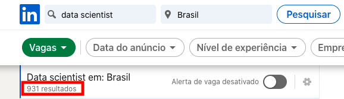
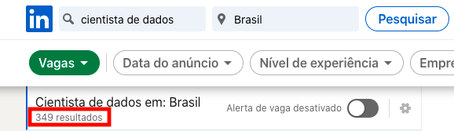
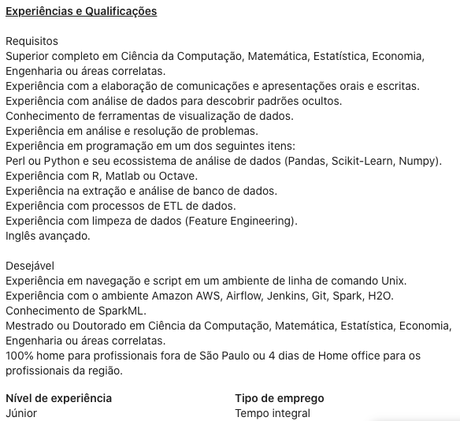
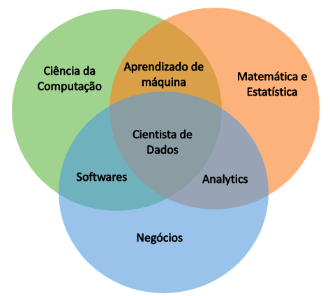
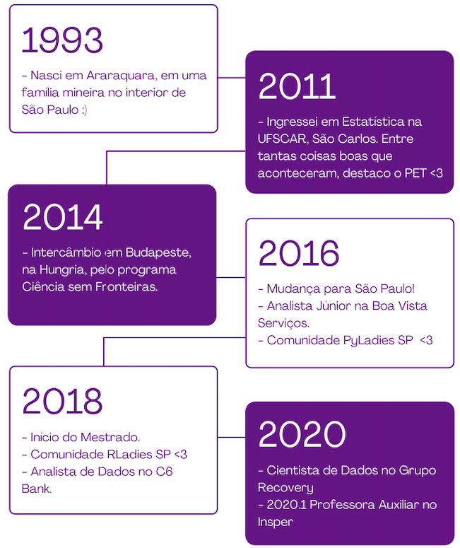
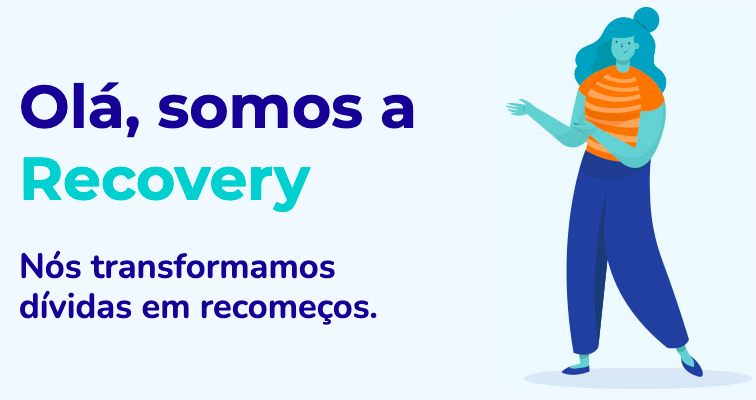
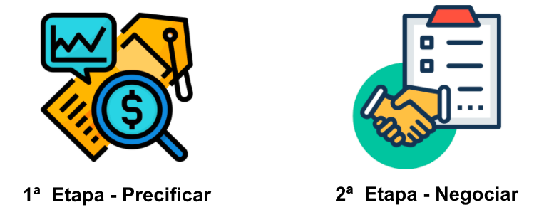
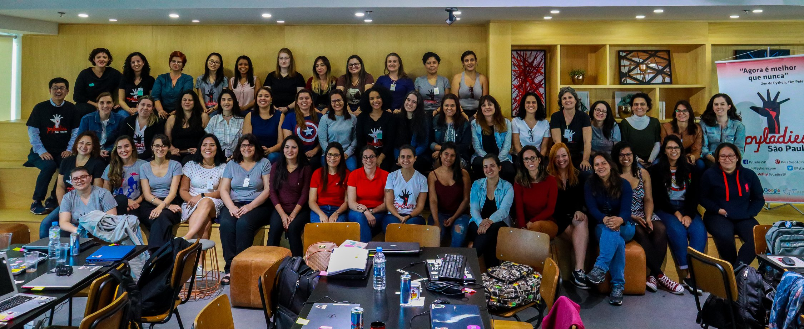
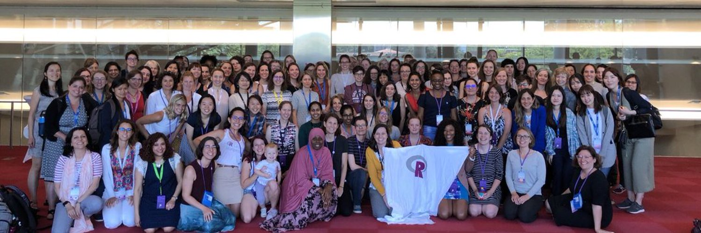

```{r setup, include=FALSE}
options(htmltools.dir.version = FALSE)

knitr::opts_chunk$set(
  echo = FALSE,
  fig.align = "center",
  message = FALSE,
  warning = FALSE,
  cache = TRUE
)
```


##glimpse( Angélica )

- Bacharel em Estatística - [Departamento de Estatística - Universidade Federal de São Carlos](http://www.des.ufscar.br/front-page)

- Mestranda no [Programa de Pós-Graduação em Ciência da Computação - Universidade Federal do ABC](https://poscomp.ufabc.edu.br/)

  - Pesquisando sobre Interpretabilidade de Modelos Opacos no contexto de Modelagem Uplift
  - Orientada por [Ronaldo Prati](https://www.ufabc.edu.br/ensino/docentes/ronaldo-cristiano-prati)
  

- Cientista de Dados - [Grupo Recovery](linkedin.com/company/gruporecovery)

- Professora Auxiliar no programa de [Pós Graduação em Data Science e Decisão](https://www.insper.edu.br/pos-graduacao/programas-avancados/programa-avancado-em-data-science-e-decisao/) - [Insper](https://www.insper.edu.br/) 

- [PyLadies São Paulo](https://www.sympla.com.br/produtor/PyLadiesSP)`r emo::ji("red_heart")`
  - [Grupo de Estudos em Data Science (GEDS)](https://pyladiessp.github.io/data-science/)

- [R-Ladies São Paulo](https://www.meetup.com/pt-BR/R-Ladies-Sao-Paulo) `r emo::ji("purple_heart")`


---
class: middle

#Cientistas de Dados? Quem são?

```{r, out.width="50%"}
knitr::include_graphics("img/queme.jpg")
```
 

---
class: 

##Cientista de Dados no mercado de trabalho

###Busca rápida no Linkedin (ontem - 14/abril/21)

```{r, out.width="50%"}

```


```{r, out.width="50%"}

```

</br>
As duas pesquisas foram feitas considerando Brasil!

---
class:

##Cientista de Dados no mercado de trabalho

###Busca rápida no Linkedin (ontem - 14/abril/21)

```{r, out.width="60%"}

```

---
class:

##Cientista de Dados no mercado de trabalho

###Busca de informações no [VAGAS.com](https://www.vagas.com.br/cargo/data-scientist) (ontem - 14/abril/21)

```{r, out.width="90%" , fig.cap="Resultado do VAGAS.com para o cargo Data Scientist"}
knitr::include_graphics(c("img/vagas1.png"))
```


---
class:

##Ciência de Dados


```{r, out.width="70%", fig.cap="Ciência de Dados é composta por várias áreas diferentes!"}

```

---
class:

##Ciclo da Ciência de Dados


```{r, out.width="70%", fig.cap="Imagem do Livro 'Ciência de Dados em R' da Curso-R."}
knitr::include_graphics("https://livro.curso-r.com/assets/img/manipulacao/ciclo-ciencia-de-dados.png")
```

---
class: middle

#Como começa a carreira de quem trabalha nessa área?


```{r, out.width="30%", fig.show='hold'}
#entender como colocar essa imagem
knitr::include_graphics("https://i.pinimg.com/originals/1c/3a/0d/1c3a0d8ce9c4a92344ae924ccda10149.gif")
```


---
class: 

##Um pouco sobre a minha jornada até agora!

```{r, out.width="60%"}

```

---
class:

###Janeiro 2016 - Analista de Modelagem na Boa Vista Serviços

- É uma empresa de informações de crédito, com dados comerciais e cadastrais de mais de 130 milhões de empresas e consumidores do Brasil.


--

- Principais atividades:
  - Desenvolvimento de modelos de crédito, sinistro e de propensão a ativação de produtos.
  - Atendimento e suporte técnico à área comercial, de produtos e clientes.

--

###Outubro 2018 - Analista de Credito no C6 Bank

- É um banco digital brasileiro que oferece serviços como conta corrente, cartão de crédito, opções de investimentos, conta global, entre outros.


--

- Principais atividades:
  - Estruturação de fluxo de abertura de conta para Pessoa Física e MEI (Micro Empreendedor Individual)
  - Estruturação de políticas de concessão de crédito
  - Análise da carteira de Pessoa Física e Jurídica e desenvolvimento de políticas de manutenção de crédito.

---
class: 

###Maio 2020 - Cientista de Dados no Grupo Recovery

- É uma empresa especialista em **recuperação de crédito**

--

- Realiza a gestão e administração de dívidas

--

- O desafio é oferecer as melhores condições para que os clientes quitem suas dividas e voltem a ter crédito no mercado

--

- Mais de 25 milhões de clientes

--

- Mais de 3 milhões de acordos realizados


--


```{r, out.width="70%"}

```

---
class:

## Aplicação de Ciência de Dados na Recovery 


```{r, out.width="60%"}

```

--

### Problema: Compra de Carteiras

--

- Entender o quanto é possível recuperar de uma carteira de clientes é essencial para precificar.

--

- Construção de modelos para identificar os grupos que tem maior probabilidade de recuperação.

--

- Projeção de recuperação considerando o custo dos canais de contato com o cliente.

---
class:

## Aplicação de Ciência de Dados na Recovery 


```{r, out.width="60%"}

```


### Problema: Abordar os clientes mais propensos a pagar

--

- Modelo de Propensão ao pagamento da dívida.

--

- Dado que o cliente já está devendo qual a chance dele pagar?

--

- Desenvolvimento de modelos considerando informações internas e externas do cliente.

---
class: 

#Cientista de dados precisa dominar muitos assuntos?

--

###Sim, mas um passo de cada vez...

```{r, out.width="30%"}
knitr::include_graphics("https://i.pinimg.com/originals/41/26/41/412641d738df74825c040305e7536bf1.gif")
```

---
class: 

#Importante!

- Cientista de dados trabalha em equipe!

```{r, out.width="40%"}
knitr::include_graphics("https://image.freepik.com/free-vector/character-couple-solving-puzzle-pieces-illustration_53876-32627.jpg")
```

--

- Descubra o que você gosta e abrace isso `r emo::ji("red_heart")`

--

- Aproveite muito as oportunidades que a faculdade oferece!  #saudades

--

- **Faça parte de comunidades!**

---
class:

#Comunidades 

São excelentes oportunidades para ter contato com pessoas e tecnologia! 

**pessoas >> tecnologia**

--

- **Meetup** é uma plataforma para encontrar e desenvolver comunidades locais. [Meetup - meetup.com](https://www.meetup.com/pt-BR/) 

- Python

  - [Grupy Sanca](https://www.meetup.com/pt-BR/grupy-sanca/)

  - [Caipyra 2019 em São Carlos](https://2019.caipyra.python.org.br/)
  
  - PyLadies `r emo::ji("red_heart")`


- R
  
  - [Fórum da Comunidade R no Discourse - Curso-R](https://discourse.curso-r.com/)

  - [satRday São Paulo 2019](https://saopaulo2019.satrdays.org/)
  
  - R-Ladies `r emo::ji("purple_heart")`

---
class: 

##PyLadies

- PyLadies é um grupo de mentoria internacional cujo foco é ajudar mais mulheres a se tornarem participantes ativas na comunidade de código aberto Python. O objetivo do PyLadies é aumentar a participação das mulheres no mundo da programação.

```{r, out.width="80%"}

```

--

- Saiba mais:
  - Sympla: [PyLadies São Paulo](https://www.sympla.com.br/produtor/PyLadiesSP)
  - Facebook: [PyLadies São Carlos](https://pt-br.facebook.com/PyLadiesSaoCarlos/)
  - Twitter: [PyLadies São Paulo](https://twitter.com/pyladiessp), [PyLadies Sanca](https://twitter.com/PyLadiesSanca)
  - Youtube: [PyLadies São Paulo](https://www.youtube.com/channel/UCpXmSBsTpeMtzjGDn88sBTA)


---
class: 


##R-Ladies

- R-Ladies é uma organização mundial que **promove a diversidade de gênero** na comunidade da linguagem R. A missão da R-Ladies é alcançar uma representação proporcional ao encorajar, inspirar e capacitar pessoas de gêneros atualmente sub-representados na comunidade R.


```{r, out.width="80%"}

```

--

- Saiba mais:
  - Website RLadies Global: [https://rladies.org/](https://rladies.org/)
  - Capitulos da R-Ladies no Brasil: [https://github.com/R-Ladies-Sao-Paulo/RLadies-Brasil](https://github.com/R-Ladies-Sao-Paulo/RLadies-Brasil#readme)
  - Twitter: [@RLadiesSaoPaulo](https://twitter.com/RLadiesSaoPaulo)
  - Instagram: [@RLadiesSaoPaulo](http://instagram.com/RLadiesSaoPaulo)
  - Facebook: [@RLadiesSaoPaulo](http://facebook.com/RLadiesSaoPaulo)
  - MeetUp: [R-Ladies Sao Paulo](https://www.meetup.com/pt-BR/R-Ladies-Sao-Paulo)


<!-------------FINALIZANDO A APRESENTAÇÃO----------->


---
class: middle

# Referências

- **Ciência de Dados**:
  - [Livro Ciência de Dados em R](https://livro.curso-r.com/) - [Curso-R](https://curso-r.com/)
  - [R for Data Science](https://r4ds.had.co.nz)
  - Slides sobre Ciência de Dados da [Barbara Maia](https://www.linkedin.com/in/barbara-ribeiro-maia-01997329).

- **Markdown e Xaringan**:
  - [R Markdown: The Definitive Guide](https://bookdown.org/yihui/rmarkdown/)
  - [Comunicando seus resultados em R - Aprenda a criar apresentações reprodutíveis](https://r-ladies-sao-paulo.github.io/xaringan/)
  - [Apresentação da documentação Xaringan](http://slides.yihui.name/xaringan/) 

 

---
class: middle  


###Obrigada pela atenção de vocês!

```{r, out.width="50%"}
knitr::include_graphics("https://attachments.f95zone.to/2021/01/1001428_thanks.gif")
```

###Agradeço também

- Ao Professor Pedro Ferreira Filho pelo convite.

- Ao [Grupo Recovery](https://www.linkedin.com/company/gruporecovery), por poder dividir sobre o mundo de Recuperação com vocês.

- [Beatriz Milz](https://beatrizmilz.com/) e [William Amorim](https://wamorim.com/) pelo apoio e incentivo.


Apresentação feita com [ `xaringan` ](https://github.com/yihui/xaringan).
